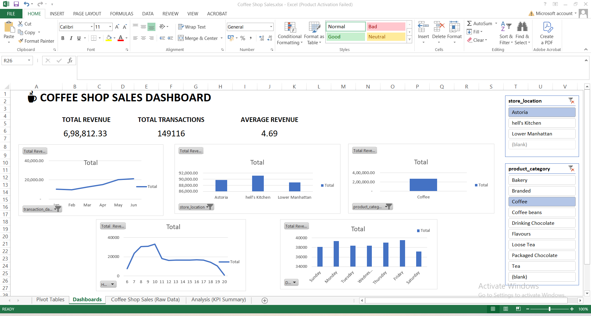

# ☕ Coffee Shop Sales Analysis Dashboard (Microsoft Excel)

## 📌 Project Overview

This project analyzes coffee shop sales data using Microsoft Excel. The goal was to transform raw sales data into meaningful business insights through data preparation, KPI analysis, Pivot Tables, Pivot Charts, and an interactive dashboard.

The dashboard helps identify sales trends, top-performing stores, best-selling product categories, peak business hours, and customer purchasing patterns.

---

## 🎯 Business Objective

The objective of this project is to answer the following business questions:

- Which store generates the highest revenue?
- Which product category contributes the most revenue?
- Which products sell the highest quantity?
- How do sales trend over time?
- Which hours of the day generate the highest sales?
- Which days of the week are the busiest?

---

## 🛠️ Tools Used

- Microsoft Excel
- Excel Tables
- Excel Formulas
- Pivot Tables
- Pivot Charts
- Slicers
- Dashboard Design

---

## 📂 Dataset Information

**Dataset:** Coffee Shop Sales (Maven Roasters)

**Total Transactions:** 149,116

**Columns Used**

- Transaction ID
- Transaction Date
- Transaction Time
- Transaction Quantity
- Store Location
- Product Category
- Product Type
- Product Detail
- Unit Price

---

## 🧹 Data Preparation

The following steps were performed before analysis:

- Created a **Revenue** column using:
  ```
  Revenue = Transaction Quantity × Unit Price
  ```

- Created an **Hour** helper column using:
  ```
  =HOUR(transaction_time)
  ```

- Created a **Day** helper column using:
  ```
  =TEXT(transaction_date,"dddd")
  ```

- Converted raw data into an Excel Table for dynamic analysis.

---

## 📊 KPI Metrics

The following Key Performance Indicators (KPIs) were calculated:

| KPI | Value |
|------|---------|
| Total Revenue | ₹698,812.33 |
| Average Revenue | ₹4.69 |
| Total Transactions | 149,116 |

---

## 📈 Analysis Performed

### Revenue by Store Location

Identified the highest revenue-generating store.

### Revenue by Product Category

Compared revenue across all product categories.

### Quantity Sold by Product Category

Analyzed the most frequently sold products.

### Monthly Revenue Trend

Analyzed revenue growth over time.

### Revenue by Hour

Identified peak business hours.

### Revenue by Day

Compared sales across weekdays.

---

## 📊 Dashboard Features

- KPI Cards
- Monthly Revenue Trend
- Revenue by Store
- Revenue by Product Category
- Revenue by Hour
- Revenue by Day
- Product Category Slicer
- Store Location Slicer
- Interactive Dashboard

---

## 📌 Key Business Insights

- Hell's Kitchen generated the highest revenue among all store locations.
- Coffee contributed the highest revenue across all product categories.
- Coffee was also the highest-selling product category by quantity.
- Morning hours recorded the highest customer activity.
- Monday generated the highest revenue compared to other weekdays.
- Revenue showed an increasing trend over the six-month period.

---

## 💡 Business Recommendations

- Increase inventory for Coffee products during peak hours.
- Allocate additional staff during morning rush hours.
- Replicate the business strategy of the highest-performing store across other locations.
- Launch promotional campaigns on weekdays with lower sales.
- Use monthly sales trends to improve inventory planning and forecasting.

---

## 🖥️ Dashboard Preview

> Add your dashboard screenshot below.



---

## 📁 Repository Structure

```
Coffee-Shop-Sales-Excel-Dashboard/
│
├── Coffee Shop Sales.xlsx
├── Dashboard.png
├── README.md
└── Dataset/
    └── Coffee Shop Sales.csv
```

---

## 📚 Skills Demonstrated

- Data Cleaning
- Data Preparation
- Excel Formulas
- KPI Analysis
- Data Analysis
- Pivot Tables
- Pivot Charts
- Dashboard Design
- Business Intelligence
- Data Visualization
- Business Insights

---

## 🚀 Project Outcome

Successfully transformed raw sales data into an interactive business dashboard that enables decision-makers to monitor performance, identify trends, and make data-driven decisions.

---

## 👩‍💻 Author

**Koushikya Maroju**

🎓 B.Tech Information Technology

📍 Hyderabad, India

🔗 LinkedIn: https://www.linkedin.com/in/koushikya-maroju/

💻 GitHub: https://github.com/koushikya04
